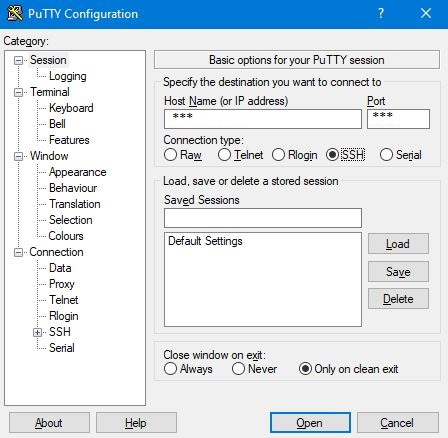

# Ansible Foundation Workshop Hands-On Guide
This article is a step-by-step guide for the hands-on session included in the Ansible Foundation Workshop conducted by ESD PSS Infra department. This hands-on session serves to teach you how to write simple Ansible Playbooks. The knowledge gained shall build the foundation necessary to utilise Ansible's various features and modules for complex use cases.


## 1. Setup Ansible
Ansible can be used to configure any target system that supports the SSH protocol and Python 2/3 library. However, Ansible's control node can only run on Unix OS (Ubuntu, MacOS, Red Hat, etc.). For this workshop, an Ubuntu 18.04 VM with Ansible is already prepared for you.

### 1.1 (Optional) Install Ansible
To install Ansible on an Ubuntu 18.04 VM, run the following commands as a sudo user:
```bash
sudo apt-add-repository ppa:ansible/ansible
sudo apt update
sudo apt install ansible
```


<div style="page-break-after: always;"></div>

## 2. Access Ansible Control Node Remotely
### 2.1 For Windows PC
1. Install software PuTTY  

    

1. Run PuTTY and start a session with the following settings:  

    *  Host Name: 111.223.106.169

    *  Port: 20210

    *  Connection type: SSH  

    

1. In the Terminal that appears, login using the following credentials (replace 'X' with the number assigned to you):

    *  Username: userX

    *  Password: userX

### 2.2 For Ubuntu/Debian PC
1. Access the command console

1. Update Package list

    ```bash
    sudo apt update
    ```

1. Install OpenSSH server

    ```bash
    sudo apt install openssh-server
    ```

1. SSH to the target VM (replace 'X' with the number assigned to you). Password is the same as the username.

    ```bash
    ssh userX@111.223.106.169 -p 20210
    ```


<div style="page-break-after: always;"></div>

## 3. Hands-On Exercises
Before the start of the hands-on exercise, run the following command to create a directory to work in:

```
mkdir /home/userX/ansible-workshop
cd /home/userX/ansible-workshop
```

### Exercise 1 - Introduction to Playbook
#### Part One - Basic Introduction
1. Create the directory for exercise 1

    ``` 
    mkdir -p ex-1/playbooks
    cd ex-1/playbooks
    ```
    
1. Create the ansible script for part one of exercise 1
    
    ```
    nano exercise-1-part-one.yaml
    ```
    
    And fill in the file with the following script
    
    ```
    - name: Ansible Familiarization
      hosts:
        targetnodeX

      tasks:
        - name: Print Task 1
          debug:
            msg: "This is Task 1"

        - name: Print Task 2
          debug:
            msg: "This is Task 2"

        - name: Print Task 3
          debug:
            msg: "This is Task 3"
    ```
    
    Once everything is filled up, save the file by pressing `ctrl-x` then `y` for yes and lastly `enter`.
    
1. Create the ansible host file for the task

    ```
    nano inventory.yaml
    ```
    
    Add your target node hostname/ip address into the file (Replace 'X' with the number assigned to you)
    
    ```
    targetnodeX
    or
    10.0.1.21X
    ```
    
1. To run the ansible script, use the following command:

    ```
    ansible-playbook -ki inventory.yaml exercise-1-part-one.yaml
    ```
    
    -k : prompt user to input ssh password
    
    -i : to pass in the inventory file

#### Part Two - Introduction to Roles & Tags
1. Create the ansible script for part two of exercise 1
    
    ```
    nano exercise-1-part-two.yaml
    ```
    
    And fill in the file with the following script
    
    ```
    - name: Ansible Familiarization
      hosts:
        targetnodeX
      roles:
        - role: task-1
          tags: task-1
        - role: task-2
          tags: task-2
        - role: task-3
          tags: task-3
    ```
    
1. Create the roles directory

    ```
    mkdir roles
    ```
    
1. Create the task folder in the roles directory

    ```
    mkdir -p roles/task-1/tasks
    mkdir -p roles/task-2/tasks
    mkdir -p roles/task-3/tasks
    ```

1. Create the `main.yaml` file in the task folder
    
    ```
    nano roles/task-1/tasks/main.yaml
    ```
    
    Fill in the `main.yaml` file with the following script
    
    ```
    - name: Print Task 1
      debug:
        msg: "This is Task 1"
    ```

    Repeat this step for task-2 & task-3, replacing the number as required

1. To run the ansible script, use the following command:
    
    ```
    ansible-playbook -ki inventory.yaml exercise-1-part-two.yaml --skip-tags=task-2
    ```
    
    --skip-tags : skip the task with the tag specified
    
    --tags: run the task with the tag specified
    

### Exercise 2 - Using Variables
1. Return back to `ansible-workshop` directory

    ```
    cd /home/userX/ansible-workshop
    ```

1. Create a directory for exercise 2

    ``` 
    mkdir -p ex-2/playbooks
    cd ex-2/playbooks
    ```
    
1. Create the ansible script for exercise 2
    
    ```
    nano exercise-2.yaml
    ```
    
    And fill in the file with the following script
    
    ```
    - name: Write a playbook to output variables declared in group_vars folder
      hosts:
        managed_node
      roles:
        - role: single-variable
        - role: multiple-variable
    ```
    
1. Create the ansible host file for the task

    ```
    nano inventory.yaml
    ```
    
    Add your target node hostname/ip address into the file (Replace 'X' with the number assigned to you)
    
    ```
    [managed_node]
    targetnodeX
    ```
    
1. Create the roles directory
    
    ```
    mkdir roles
    ```
    
1. Create the task folders in the roles directory

    ```
    mkdir -p roles/single-variable/tasks
    mkdir -p roles/multiple-variable/tasks
    ```

1. Create the `main.yaml` file for both tasks
    
    For single-variable task:
    
    ```
    nano roles/single-variable/tasks/main.yaml
    ```
    
    Fill in the `main.yaml` file of single-variable task with the following script
    
    ```
    - name: Printing single variable from group_vars folder
      debug:
        msg: "Required to install '{{required_package}}' module"
    ```

    For multiple-variable task:
    
    ```
    nano roles/multiple-variable/tasks/main.yaml
    ```
    
    Fill in the `main.yaml` file of multiple-variable task with the following script
    
    ```
    - name: Printing single variable from group_vars folder
      debug:
        msg: "Already installed {{item}} module"
      loop: "{{installed_package}}"
    ```
    
1. Create the variable file
    
    First create the group variable directory
    
    ```
    mkdir group_vars
    ```
    
    Next create the variable file
    
    ```
    nano group_vars/all.yaml
    ```
    
    Fill in the `all.yaml` files with the following variables
    
    ```
    required_package: openssh-server

    installed_package:
      - openssh-client
      - vim
      - python3
    ```
  
1. To run the ansible script, use the following command:

    ```
    ansible-playbook -ki inventory.yaml exercise-2.yaml
    ```

### Exercise 3 - Privilege Escalation
1. Return back to `ansible-workshop` directory

    ```
    cd /home/userX/ansible-workshop
    ```

1. Create a directory for exercise 4

    ``` 
    mkdir -p ex-3/playbooks
    cd ex-3/playbooks
    ```
    
1. Create the ansible script for exercise 4
    
    ```
    nano exercise-3.yaml
    ```
    
    And fill in the file with the following script
    
    ```
    - name: Install packages
      hosts:
        managed_node
      become: yes

      roles:
        - role: installpackage
          tags: installpackage
    ```
    
1. Create the ansible host file for the task

    ```
    nano inventory.yaml
    ```
    
    Add your target node hostname/ip address into the file (Replace 'X' with the number assigned to you)
    
    ```
    [managed_node]
    targetnodeX
    ```
    
1. Create the roles directory
    
    ```
    mkdir roles
    ```
    
1. Create the task folders in the roles directory

    ```
    mkdir -p roles/installpackage/tasks
    ```

1. Create the `main.yaml` file
    
    ```
    nano roles/installpackage/tasks/main.yaml
    ```
    
    Fill in the `main.yaml` file of installpackage task with the following script
    
    ```
    - name: Install nginx package
      apt:
        name: nginx
        state: present

    - name: Start nginx service
      service:
        name: nginx
        state: started
    ```
      
1. To run the ansible script, use the following command:
    
    Run the script to only target the managed node:
    
    ```
    ansible-playbook -ki inventory.yaml exercise-3.yaml
    ```

### Exercise 4 - Target Control
1. Return back to `ansible-workshop` directory

    ```
    cd /home/userX/ansible-workshop
    ```

1. Create a directory for exercise 4

    ``` 
    mkdir -p ex-4/playbooks
    cd ex-4/playbooks
    ```
    
1. Create the ansible script for exercise 4
    
    ```
    nano exercise-4.yaml
    ```
    
    And fill in the file with the following script
    
    ```
    - name: First script to target only one managed node
      hosts:
        managed_node
      roles:
        - role: get-disk-usage
        - role: get-block-devices
      tags: managed_node

    - name: Second script to target both the managed node & localhost
      hosts:
        all_node
      roles:
        - role: get-disk-usage
        - role: get-block-devices
      tags: all_node
    ```
    
1. Create the ansible host file for the task

    ```
    nano inventory.yaml
    ```
    
    Add your target node hostname/ip address into the file (Replace 'X' with the number assigned to you)
    
    ```
    [managed_node]
    targetnodeX

    [all_node]
    targetnodeX
    localhost
    ```
    
1. Create the roles directory
    
    ```
    mkdir roles
    ```
    
1. Create the task folders in the roles directory

    ```
    mkdir -p roles/get-disk-usage/tasks
    mkdir -p roles/get-block-devices/tasks
    ```

1. Create the `main.yaml` file for both tasks
    
    For get-disk-usage task:
    
    ```
    nano roles/get-disk-usage/tasks/main.yaml
    ```
    
    Fill in the `main.yaml` file of get-disk-usage task with the following script
    
    ```
    - name: Get disk usage data
      shell: "df -h"
      register: DiskUsageData

    - name: Print disk usage data
      debug:
        msg: "{{DiskUsageData.stdout_lines}}"
    ```
    
    For get-block-devices task:
    
    ```
    nano roles/get-block-devices/tasks/main.yaml
    ```

    Fill in the `main.yaml` file of `get-block-devices` task with the following script
    
    ```
    - name: Get block devices data
      shell: "lsblk"
      register: BlockDeviceData

    - name: Print block devices data
      debug:
        msg: "{{BlockDeviceData.stdout_lines}}"
    ```
      
1. To run the ansible script, use the following command:
    
    Run the script to only target the managed node:
    
    ```
    ansible-playbook -ki inventory.yaml exercise-4.yaml --tags=managed_node
    ```
    
    Run the script to target both the managed node & control node:
    
    ```
    ansible-playbook -ki inventory.yaml exercise-4.yaml --tags=all_node
    ```


<div style="page-break-after: always;"></div>

## Appendix A
### Useful Ubuntu Commands
Change directory to current user's home directory
```bash
cd ~
```

Change directory to a specific path
```bash
cd /path/to/directory
```

Change directory to a relative path
```bash
cd path/to/directory/from/current/directory
```

List down all files and folders in the current directory
```bash
ls -al
```

List down all files and folders in the specified directory
```bash
ls -al /path/to/directory
```

Edit file with nano text editor  
To save your file when inside the editor: `CTRL` + `o`, then `ENTER`  
To exit the editor: `CTRL` + `x`  
```bash
nano your_file_name
```

Access target server remotely through SSH protocol
```bash
ssh <username>@<target_ip> -p <port_number(default is 22)>
```

Terminate your current user's session
```bash
exit
```
