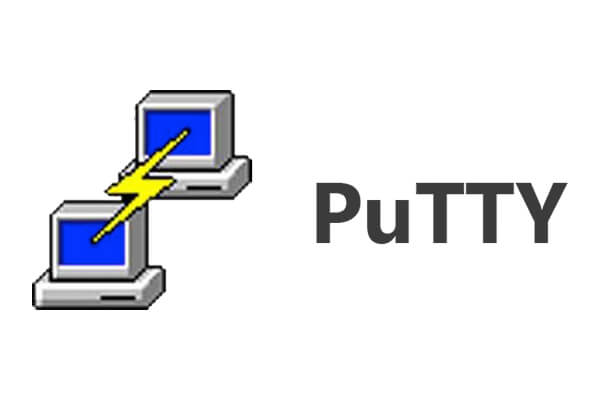

# Ansible Foundation Workshop Hands-On Guide
This article is a step-by-step guide for the hands-on session included in the Ansible Foundation Workshop conducted by ESD PSS Infra department. This hands-on session serves to teach you how to write simple Ansible Playbooks. The knowledge gained shall build the foundation necessary to utilise Ansible's various features and modules for complex use cases.


## 1. Setup Ansible
Ansible can be used to configure any target system that supports the SSH protocol and Python 2/3 library. However, Ansible's control node can only run on Unix OS (Ubuntu, MacOS, Red Hat, etc.). For this workshop, an Ubuntu 18.04 VM with Ansible is already prepared for you.

### 1.1 (Optional) Install Ansible
To install Ansible on an Ubuntu 18.04 VM, run the following commands as a sudo user:
```bash
sudo apt-add-repository ppa:ansible/ansible
sudo apt update
sudo apt install ansible
```


<div style="page-break-after: always;"></div>

## 2. Access Ansible Control Node Remotely
### 2.1 For Windows PC
1. Install software PuTTY  

    

1. Run PuTTY and start a session with the following settings:  

    *  Host Name: 111.223.106.169

    *  Port: 20210

    *  Connection type: SSH  

    

1. In the Terminal that appears, login using the following credentials (replace 'X' with the number assigned to you):

    *  Username: userX

    *  Password: userX

### 2.2 For Ubuntu/Debian PC
1. Access the command console

1. Update Package list

    ```bash
    sudo apt update
    ```

1. Install OpenSSH server

    ```bash
    sudo apt install openssh-server
    ```

1. SSH to the target VM (replace 'X' with the number assigned to you). Password is the same as the username.

    ```bash
    ssh userX@111.223.106.169 -p 20210
    ```


<div style="page-break-after: always;"></div>

## 3. Hands-On Exercises
Before the start of the hands-on exercise, run the following command to create the `ansible-workshop` directory to work in (Replace 'X' with the number assigned to you):

```
mkdir /home/userX/ansible-workshop
cd /home/userX/ansible-workshop
```

### Exercise 1 - Introduction to Ansible
#### Part One - Basic Introduction
1. Create the `playbooks` directory 

    ``` 
    mkdir playbooks
    cd playbooks
    ```
    
1. Create the main ansible script file to store all exercise task
    
    ```
    touch main-script.yaml
    ```
    
1. Create exercise 1 part 1 task in `main-script.yaml`

    Open `main-script.yaml` file for editing
    
    ```
    nano main-script.yaml
    ```
    
    Copy task script for exercise 1 part 1 into `main-script.yaml` (Replace 'X' with the number assigned to you)
    
    ```
    - name: Exercise 1 Part 1 - Introduction to Ansible
      hosts:
        targetnodeX

      tasks:
        - name: Print Task 1
          debug:
            msg: "This is Task 1"

        - name: Print Task 2
          debug:
            msg: "This is Task 2"

        - name: Print Task 3
          debug:
            msg: "This is Task 3"
    ```
    
    Once everything is filled up, save the file by pressing `ctrl-x` then `y` for yes and lastly `enter`.
    
1. Create the ansible host file for the task

    ```
    nano inventory.yaml
    ```
    
    Add your target node hostname/ip address into the file (Replace 'X' with the number assigned to you)
    
    ```
    targetnodeX
    or
    10.0.1.21X
    ```
    
1. To run the ansible script, use the following command:

    ```
    ansible-playbook -ki inventory.yaml main-script.yaml
    ```
    
    -k : prompt user to input ssh password
    
    -i : to pass in the inventory file

#### Part Two - Introduction to Roles & Tags
1. Create exercise 1 part 2 task in `main-script.yaml`
    
    ```
    nano main-script.yaml
    ```
    
    Copy task script for exercise 1 part 2 into `main-script.yaml`, add this script below exercise 1 part 1 task (Replace 'X' with the number assigned to you)
    
    ```
    - name: Exercise 1 Part 2 - Introduction to roles & tags
      hosts:
        targetnodeX
      roles:
        - role: task-1
        - role: task-2
        - role: task-3
      tags: ex-1-2
    ```
    
    Also add in the following tag at the end of exercise 1 part 1 task (take note of the spacing)
    
    ```
    tags: ex-1-1
    ```
    
    Save the `main-script.yaml` file
    
1. Create the `roles` directory

    ```
    mkdir roles
    ```
    
1. Create the task folder in the `roles` directory

    ```
    mkdir -p roles/task-1/tasks
    mkdir -p roles/task-2/tasks
    mkdir -p roles/task-3/tasks
    ```

1. Create the `main.yaml` file in the task folder
    
    ```
    nano roles/task-1/tasks/main.yaml
    ```
    
    Fill in the `main.yaml` file with the following script
    
    ```
    - name: Print Task 1
      debug:
        msg: "This is Task 1"
    ```

    Repeat this step for task-2 & task-3, replacing the number as required

1. To run exercise 1 part 2 task, use the following command:
    
    ```
    ansible-playbook -ki inventory.yaml main-script.yaml --tags=ex1-2
    ```
    
    --tags: run the task with the tag specified
    
    --skip-tags : skip the task with the tag specified
    
### Exercise 2 - Using Variables & Loop function    
1. Create exercise 2 task in `main-script.yaml`
    
    ```
    nano main-script.yaml
    ```
    
    Copy task script for exercise 2 into `main-script.yaml`
    
    ```
    - name: Exercise 2 - Using Variables & Loop function
      hosts:
        managed_node
      roles:
        - role: single-variable
        - role: multiple-variable
      tags: ex-2
    ```
    
1. Edit the ansible host file to use group names

    ```
    nano inventory.yaml
    ```
    
    Add your target node hostname/ip address into the file (Replace 'X' with the number assigned to you)
    
    ```
    [managed_node]
    targetnodeX
    ```
    
1. Create exercise 2 task folders in the `roles` directory

    ```
    mkdir -p roles/single-variable/tasks
    mkdir -p roles/multiple-variable/tasks
    ```

1. Create the `main.yaml` file for both tasks
    
    For single-variable task:
    
    ```
    nano roles/single-variable/tasks/main.yaml
    ```
    
    Fill in the `main.yaml` file of single-variable task with the following script
    
    ```
    - name: Printing single variable from group_vars folder
      debug:
        msg: "Required to install '{{required_package}}' module"
    ```

    For multiple-variable task:
    
    ```
    nano roles/multiple-variable/tasks/main.yaml
    ```
    
    Fill in the `main.yaml` file of multiple-variable task with the following script
    
    ```
    - name: Printing single variable from group_vars folder
      debug:
        msg: "Please install {{item}} module"
      loop: "{{install_package}}"
    ```
    
1. Create the variable file
    
    First create the group variable directory
    
    ```
    mkdir group_vars
    ```
    
    Next create the variable file
    
    ```
    nano group_vars/all.yaml
    ```
    
    Fill in the `all.yaml` files with the following variables
    
    ```
    required_package: openssh-server

    install_package:
      - vim
      - python3
      - nginx
    ```
  
1. To run exercise 2 task, use the following command:

    ```
    ansible-playbook -ki inventory.yaml main-script.yaml --tags=ex2
    ```

### Exercise 3 - Privilege Escalation
1. Create exercise 3 task in `main-script.yaml`
    
    ```
    nano main-script.yaml
    ```
    
    Copy task script for exercise 3 into `main-script.yaml`
    
    ```
    - name: Exercise 3 - Privilege Escalation
      hosts:
        managed_node
      become: yes

      roles:
        - role: installpackage
      tags: ex-3
    ```

1. Create exercise 3 task folders in the `roles` directory

    ```
    mkdir -p roles/installpackage/tasks
    ```

1. Create the `main.yaml` file
    
    ```
    nano roles/installpackage/tasks/main.yaml
    ```
    
    Fill in the `main.yaml` file of installpackage task with the following script
    
    ```
    - name: Install nginx package
      apt:
        name: "{{item}}"
        state: present
      loop: "{{install_package}}"

    - name: Start nginx service
      service:
        name: nginx
        state: started
    ```
      
1. To run exercise 3 task, use the following command:
    
    Run the script to only target the managed node:
    
    ```
    ansible-playbook -Kki inventory.yaml main-script.yaml --tags=ex3
    ```
    
    -K : prompt user to input become password

### Exercise 4 - Target Control
1. Create exercise 4 task in `main-script.yaml`
    
    ```
    nano main-script.yaml
    ```
    
    Copy task script for exercise 4 into `main-script.yaml`
    
    ```
    - name: Exercise 4 - Target Control, Target only one managed node
      hosts:
        managed_node
      roles:
        - role: get-disk-usage
        - role: get-block-devices
      tags:
        - ex-4
        - ex-4-managed_node

    - name: Exercise 4 - Target Control, Target both the managed node & localhost
      hosts:
        all_node
      roles:
        - role: get-disk-usage
        - role: get-block-devices
      tags: 
        - ex-4
        - ex-4-all_node
    ```
    
1. Edit the ansible host file to add another group

    ```
    nano inventory.yaml
    ```
    
    Add your target node hostname/ip address into the file (Replace 'X' with the number assigned to you)
    
    ```
    [managed_node]
    targetnodeX

    [all_node]
    targetnodeX
    localhost
    ```

1. Create the task folders in the `roles` directory

    ```
    mkdir -p roles/get-disk-usage/tasks
    mkdir -p roles/get-block-devices/tasks
    ```

1. Create the `main.yaml` file for both tasks
    
    For get-disk-usage task:
    
    ```
    nano roles/get-disk-usage/tasks/main.yaml
    ```
    
    Fill in the `main.yaml` file of get-disk-usage task with the following script
    
    ```
    - name: Get disk usage data
      shell: "df -h"
      register: DiskUsageData

    - name: Print disk usage data
      debug:
        msg: "{{DiskUsageData.stdout_lines}}"
    ```
    
    For get-block-devices task:
    
    ```
    nano roles/get-block-devices/tasks/main.yaml
    ```

    Fill in the `main.yaml` file of `get-block-devices` task with the following script
    
    ```
    - name: Get block devices data
      shell: "lsblk"
      register: BlockDeviceData

    - name: Print block devices data
      debug:
        msg: "{{BlockDeviceData.stdout_lines}}"
    ```
      
1. To run exercise 4 task, use the following command:
    
    Run the task to only target the managed node:
    
    ```
    ansible-playbook -ki inventory.yaml main-script.yaml --tags=ex-4-managed_node
    ```
    
    Run the task to target both the managed node & control node:
    
    ```
    ansible-playbook -ki inventory.yaml main-script.yaml --tags=ex-4-all_node
    ```
    
    Run both of the task:
    
    ```
    ansible-playbook -ki inventory.yaml main-script.yaml --tags=ex-4
    ```   

<div style="page-break-after: always;"></div>

## Appendix A
### Useful Ubuntu Commands
Change directory to current user's home directory
```bash
cd ~
```

Change directory to a specific path
```bash
cd /path/to/directory
```

Change directory to a relative path
```bash
cd path/to/directory/from/current/directory
```

List down all files and folders in the current directory
```bash
ls -al
```

List down all files and folders in the specified directory
```bash
ls -al /path/to/directory
```

Edit file with nano text editor  
To save your file when inside the editor: `CTRL` + `o`, then `ENTER`  
To exit the editor: `CTRL` + `x`  
```bash
nano your_file_name
```

Access target server remotely through SSH protocol
```bash
ssh <username>@<target_ip> -p <port_number(default is 22)>
```

Terminate your current user's session
```bash
exit
```
